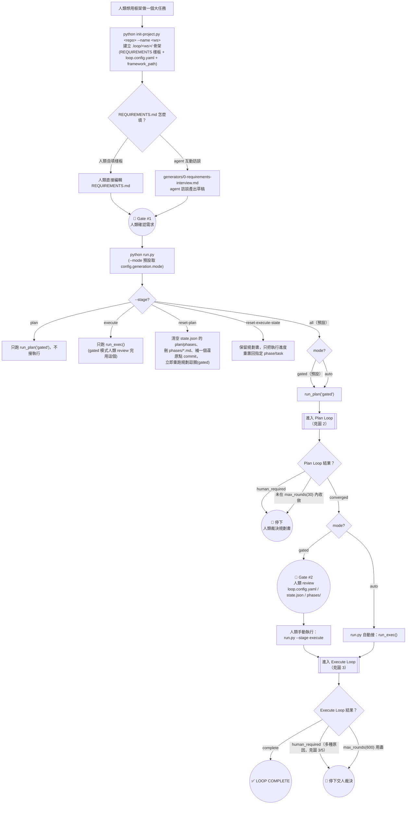
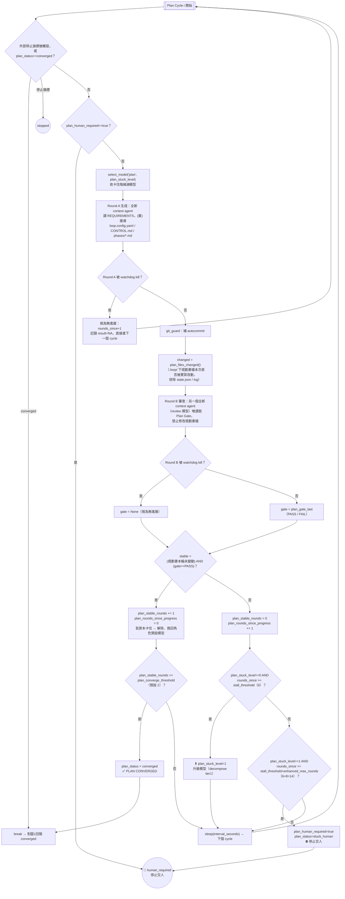
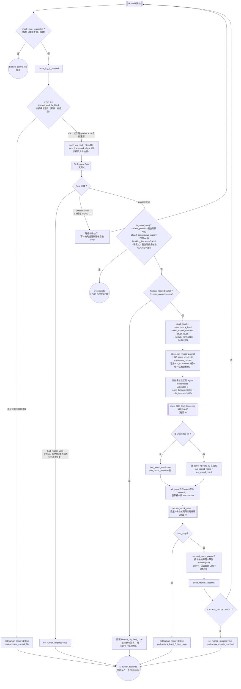
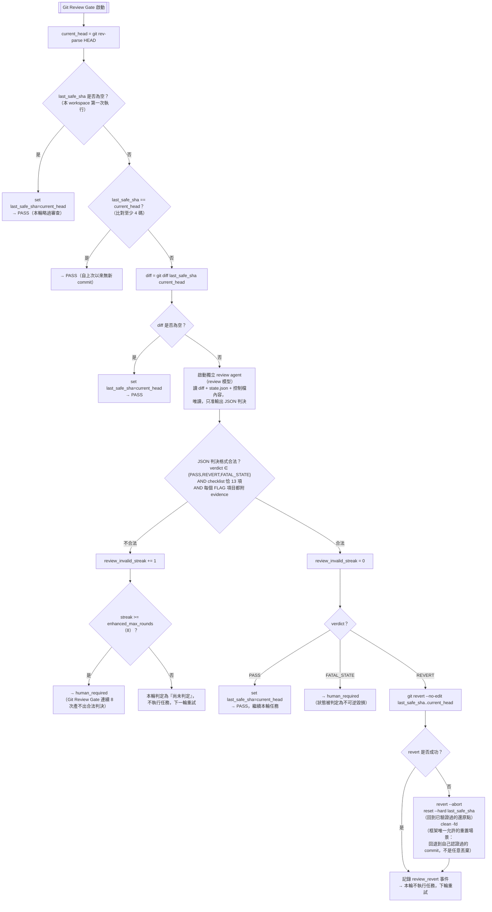
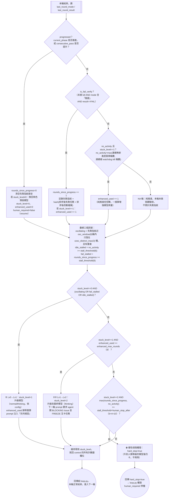
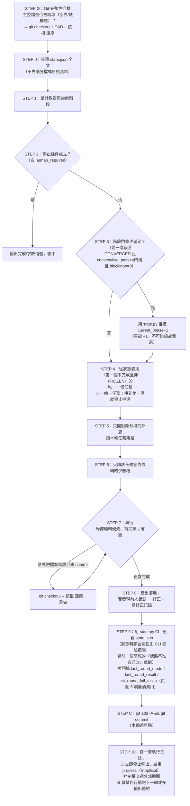

# 🗺️ 全流程詳細流程圖（init → plan → gate → execute → 收斂）

> 對照原始碼逐一畫出的**完整邏輯判斷圖**：`init-project.py` → `run.py` → `plan_loop.py` → 人類 gate → `loop.py` → 終止狀態。
> 拆成 6 張圖（總覽 + 5 張細節圖），因為單一巨圖會擠爆版面；每張圖的節點文字盡量對齊程式碼裡的變數名，方便對照原始碼。
> 所有門檻數字（`stall_threshold=6` 等）皆為 [`engine/config.py`](../engine/config.py) `DEFAULTS` 的預設值，實際專案可在 `loop.config.yaml` 覆寫。
> 用 GitHub / VS Code（Markdown Preview Mermaid Support 外掛）/ [Mermaid Live Editor](https://mermaid.live) 皆可直接渲染。

---

## 圖 1／6：總覽（init → 兩個人類 gate → 終止）

**讀圖重點**：兩個人類 gate 之間全部自動；`--stage` 是逃生/重跑用的旁路指令，正常首跑走 `all`。

---

## 圖 2／6：Plan Loop 內部（`plan_loop.py`，Round A 生成 + Round B 獨立審查）

**讀圖重點**：Round A（生成）與 Round B（審查）永遠是**兩個不同 context 的 agent**——生成的人不能自己審自己；「規劃書沒改 + Gate PASS」連續 2 次才算收斂，任何一次改動或 FAIL 都讓穩定計數歸零重數。

---

## 圖 3／6：Execute Loop 內部（`loop.py`，單一一輪的完整生命週期）

---

## 圖 4／6：Git Review Gate 細節（`run_git_review_gate`）

---

## 圖 5／6：震盪 / 卡住偵測與三層升級狀態機（`update_stuck_state`）

> **角色維 vs 升級維（同一組模型的二維調度）**：`select_model` 順風時按角色給模型（拆解用 thinking／review 用 normal／執行用 fast），
> 卡住時則沿 `stuck_level` 這把梯子往上爬（fast→normal→thinking→人類），兩套邏輯共用同一份模型清單。

---

## 圖 6／6：Agent 內部 Boot Sequence（每輪被喚醒後，agent 自己要走的步驟）

> 這段跑在圖 3 的 `EM`（agent 內部 STEP 0~10）節點裡，由 agent 自己的 prompt 規定，`loop.py` 只負責啟動/監看/收尾。

---

## 名詞對照表（圖裡縮寫 ↔ 白話）

| 圖裡出現的詞 | 白話 |
|---|---|
| `stuck_level` | 卡住等級：0=正常、1=已升級模型、2=已升到最終模型仍卡 |
| `rounds_since_progress` | 連續幾輪沒有「階段推進」或「驗證通過次數提升」 |
| `no_activity` | 連續幾輪「進度簽章」完全沒變（含被 watchdog kill 的次數） |
| `fail_fingerprint` | 本輪失敗任務 + 改動檔案的 hash，用來認出「同一種卡法反覆出現」 |
| `oscillating` | 失敗指紋在一個滑動視窗內反覆落在少數幾種上（改 A 壞 B 的訊號） |
| `enhanced_used` | 升級模型後，已經在這個等級試了幾輪 |
| `plan_stable_rounds` | 規劃書連續幾個 cycle「沒被改動 + Gate PASS」 |
| `last_safe_sha` | Git Review Gate 認證過、可以安全回退到的 commit |
| `human_required` / `plan_human_required` | 停機交人的旗標，一旦 true 只能靠人類的 resume 管道解除 |

---

> 對應原始碼：[`engine/run.py`](../engine/run.py) · [`engine/plan_loop.py`](../engine/plan_loop.py) · [`engine/loop.py`](../engine/loop.py) · [`engine/utils.py`](../engine/utils.py) · [`engine/state.py`](../engine/state.py) · [`rules/boot-sequence.md`](../rules/boot-sequence.md) · [`rules/BLUEPRINT.md`](../rules/BLUEPRINT.md)
